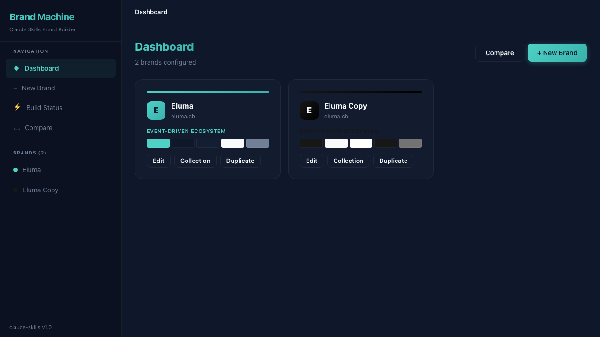
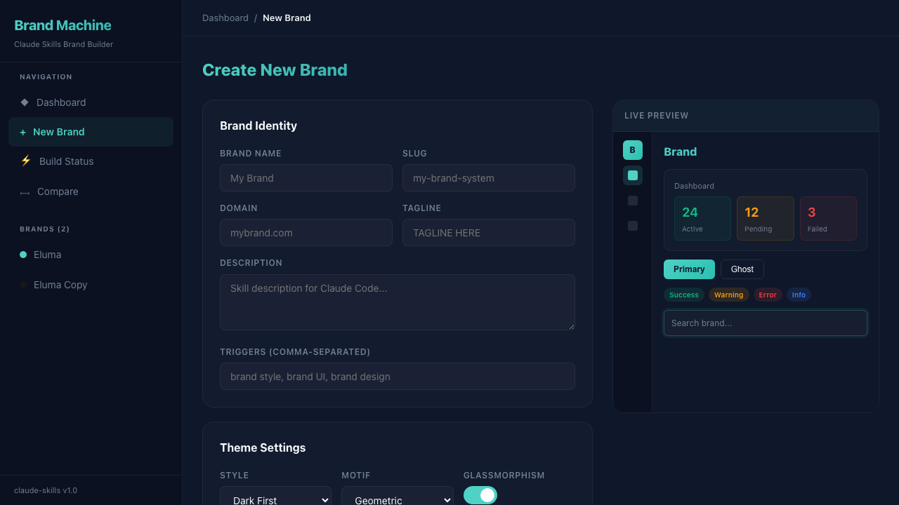
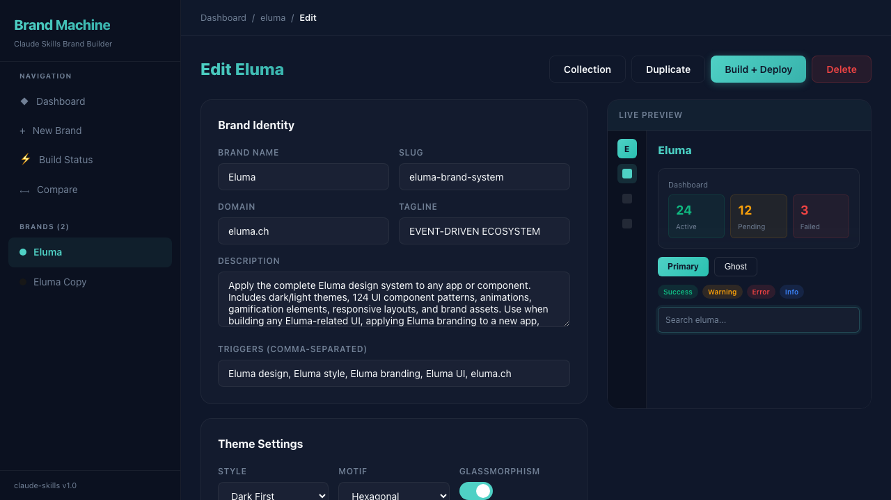
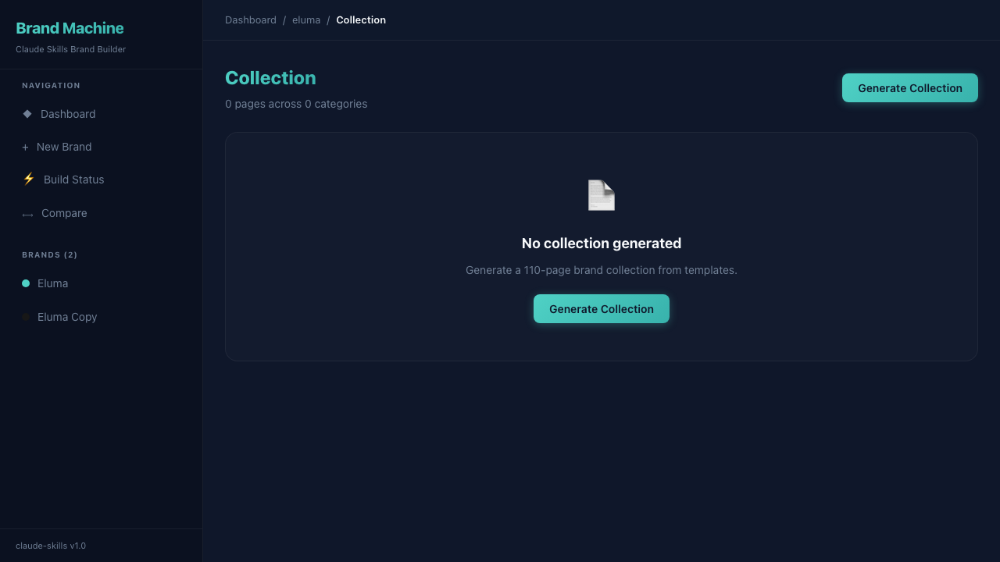

<div align="center">

<picture>
  <source media="(prefers-color-scheme: dark)" srcset=".github/assets/banner-dark.svg">
  <source media="(prefers-color-scheme: light)" srcset=".github/assets/banner-light.svg">
  
</picture>

<br />
<br />

[](https://github.com/alphinus/claude-skills/actions)
[](https://www.typescriptlang.org/)
[](https://react.dev)
[](https://vite.dev)
[](LICENSE)
[](https://github.com/alphinus/claude-skills/stargazers)

**Create branded Claude Code skills with live color picker, 110-page design collections, and AI logo generation.**

[Live Demo](https://claude-skills-beta.vercel.app) · [Quick Start](#quick-start) · [Features](#features) · [API Reference](#api-reference) · [Contributing](CONTRIBUTING.md)

</div>

---

## What is claude-skills?

A **Brand Machine** web app that turns brand definitions (colors, logos, tokens) into fully deployed [Claude Code](https://docs.anthropic.com/en/docs/claude-code) skills. Pick your brand colors in a canvas-based color wheel, preview them in real-time, generate a 110-page HTML design collection, create AI logos, and deploy — all from one UI.

> **How it works:** Brand form → `tokens.json` → `build.sh` (core templates + tokens) → `sync.sh` → Skill appears in Claude Code.

<div align="center">
  <br />
  <table>
    <tr>
      <td align="center"><strong>Dashboard</strong></td>
      <td align="center"><strong>Color Picker</strong></td>
    </tr>
    <tr>
      <td></td>
      <td></td>
    </tr>
    <tr>
      <td align="center"><strong>Live Preview</strong></td>
      <td align="center"><strong>Collection Gallery</strong></td>
    </tr>
    <tr>
      <td></td>
      <td></td>
    </tr>
  </table>
  <br />
</div>

## Features

- **Canvas-Based Color Picker** — HSL color wheel with bidirectional hex/RGB sync, smart auto-calculation of dark variants and RGB values
- **Live Preview** — Real-time preview panel showing sidebar, cards, buttons, and badges in your brand colors as you edit
- **110-Page Design Collection** — Templatized from Eluma's design system: animations, app screens, branding, social media, print materials, and 15 more categories
- **AI Logo Generation** — Generate logo-light, logo-dark, and icon variants using FLUX models via [inference.sh](https://inference.sh)
- **One-Click Build + Deploy** — Execute `build.sh` and `sync.sh` from the UI to generate and deploy skills to `~/.claude/skills/`
- **Brand Comparison** — Side-by-side preview of two brands with color token diff table
- **Preset Palettes** — 10 curated color schemes as starting points
- **Brand Duplication** — Clone any brand as a starting point for variants
- **PNG Export** — Export collection pages as screenshots via Puppeteer
- **Vercel Deployment** — Read-only API on Vercel, full CRUD locally

## Quick Start

```bash
git clone https://github.com/alphinus/claude-skills.git
cd claude-skills/app && npm install
npm run dev
```

Opens at **http://localhost:5173** — API on port 3001.

### Create your first brand

1. Click **"New Brand"** in the sidebar
2. Enter name, domain, tagline
3. Pick colors with the color wheel or choose a preset palette
4. Watch the live preview update in real-time
5. Click **"Create Brand"** → `brands/<slug>/tokens.json` is written
6. Click **"Build + Deploy"** → Skill is generated and synced to Claude Code

## Tech Stack

| Layer | Technology |
|-------|------------|
| Frontend | React 19 · Vite 6 · TypeScript · react-router-dom v7 |
| Backend | Express 5 · TypeScript (tsx) |
| Styling | Custom CSS with design tokens (no Tailwind) |
| Color Picker | Canvas-based HSL wheel (zero dependencies) |
| Image Gen | [inference.sh](https://inference.sh) CLI (FLUX models) |
| Deploy | Vercel (frontend + read-only API) |
| Storage | Filesystem (git-tracked `brands/` directory) |

## Architecture

```
claude-skills/
├── app/                      # Brand Machine web app
│   ├── server/               # Express API (brands CRUD, build, collection, images)
│   │   ├── routes/           # API route handlers
│   │   └── lib/              # Config, validation, color utils, collection generator
│   └── src/                  # React frontend
│       ├── components/       # UI kit, brand form, color picker, layout, preview
│       ├── pages/            # Dashboard, Create, Edit, Collection, Build, Compare
│       └── hooks/            # useBrands, useColorSync, useBuildStatus
├── core/                     # Brand-agnostic skill templates
│   ├── SKILL.md.template     # Skill manifest with {{PLACEHOLDERS}}
│   └── references/           # Components, animations, layouts (124 patterns)
├── brands/                   # Brand configurations (the datastore)
│   └── eluma/                # Example brand with tokens.json + collection
├── collection-templates/     # 110 templatized HTML pages
├── skills/                   # Generated skills (ready to deploy)
├── scripts/                  # CLI utilities
├── build.sh                  # core + brand → skill
└── sync.sh                   # skill → ~/.claude/skills/
```

## API Reference

| Method | Endpoint | Description |
|--------|----------|-------------|
| `GET` | `/api/brands` | List all brands |
| `GET` | `/api/brands/:slug` | Get single brand |
| `POST` | `/api/brands` | Create brand |
| `PUT` | `/api/brands/:slug` | Update brand |
| `DELETE` | `/api/brands/:slug` | Delete brand |
| `POST` | `/api/brands/:slug/duplicate` | Duplicate brand |
| `POST` | `/api/build/:slug` | Run build.sh |
| `POST` | `/api/build/:slug/sync` | Run sync.sh |
| `POST` | `/api/collection/:slug/generate` | Generate 110-page collection |
| `GET` | `/api/collection/:slug` | List collection files |
| `POST` | `/api/collection/:slug/export` | Export collection as PNG |
| `POST` | `/api/images/:slug/generate` | Generate AI logos |
| `GET` | `/api/images/:slug` | List brand images |

## `tokens.json` Schema

```json
{
  "brand": {
    "name": "Your Brand",
    "slug": "your-brand-system",
    "domain": "yourbrand.com",
    "tagline": "YOUR TAGLINE",
    "description": "Claude Code skill description...",
    "triggers": ["your brand", "your style"]
  },
  "colors": {
    "PRIMARY": "#hex",
    "PRIMARY_DARK": "#hex (auto-calculated)",
    "PRIMARY_RGB": "r,g,b (auto-calculated)",
    "BG": "#0f172a",
    "SURFACE": "#141e33",
    "TEXT": "#f8fafc",
    "MUTED": "#718096"
  },
  "theme": {
    "style": "dark-first",
    "glassmorphism": true,
    "motif": "hexagonal"
  }
}
```

## CLI Usage

```bash
# Build a specific brand
./build.sh eluma

# Deploy all skills to Claude Code
./sync.sh

# Generate collection from templates (CLI)
./scripts/generate-collection.sh your-brand

# Export collection as PNG
node scripts/export-png.js your-brand
```

## Contributing

We welcome contributions! See [CONTRIBUTING.md](CONTRIBUTING.md) for guidelines.

```bash
git clone https://github.com/alphinus/claude-skills.git
cd claude-skills/app && npm install
npm run dev
```

## License

MIT — see [LICENSE](LICENSE) for details.

---

<div align="center">

**Built by [alphinus](https://github.com/alphinus) · [Eluma Developments](https://eluma.ch)**

<sub>

[claude-skills](https://github.com/alphinus/claude-skills)

</sub>

</div>
