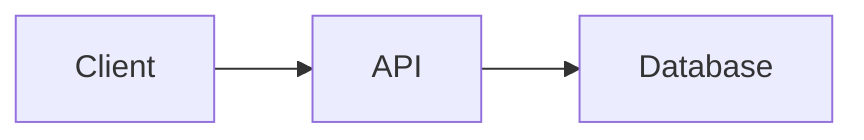

# README Patterns — Best Practices

## The 10-Second Rule
Visitors decide whether to star in 10 seconds. What they see above the fold:
1. Professional banner (animated SVG, dark/light aware)
2. Badge row (build status, version, license, stars)
3. One-liner value proposition
4. Quick links (Demo | Docs | Quick Start)

## Structure (in order)

### 1. Hero Section (center-aligned)
```html
<div align="center">
  <picture><!-- dark/light banners --></picture>
  <!-- badges -->
  **One-liner**
  [Demo](url) | [Docs](#) | [Quick Start](#)
</div>
```

### 2. What is X? (2-3 sentences)
Answer: "What does this do?" and "Why should I care?"
Include ONE screenshot or GIF immediately after.

### 3. Features (icon + text)
```markdown
- **Feature Name** — What it does, not how
- **Feature Name** — Benefit-oriented, not tech-oriented
```
Keep to 4-8 features. More = noise.

### 4. Quick Start (max 3 commands)
```bash
npm install x
npx x init
npm run dev
```
If it takes more than 3 commands, you have an onboarding problem.

### 5. Screenshots/Demo
- 2-4 high-quality screenshots
- GIF for interactive features (< 5MB)
- Dark background screenshots look more professional

### 6. Tech Stack
Use badges, not prose:
```markdown

```

### 7. Architecture (optional, for complex projects)
Mermaid diagrams work on GitHub:


### 8. Contributing CTA
Make it inviting, not bureaucratic. Link to CONTRIBUTING.md.

### 9. Footer
- Author + organization link
- Cross-links to other repos
- Small, subtle — not a billboard

## Conversion Triggers
- **Social proof:** Star count badge, "Used by X companies"
- **Low friction:** Copy-paste quick start
- **Visual quality:** Professional screenshots, no lorem ipsum
- **Authority:** Clean commit history, active issues
- **FOMO:** "New in v2.0" badge, active development signals

## Common Mistakes
- Too many badges (max 5 in hero)
- No screenshot above the fold
- Quick start that doesn't work
- Broken links
- Outdated screenshots
- Wall of text with no visual breaks
